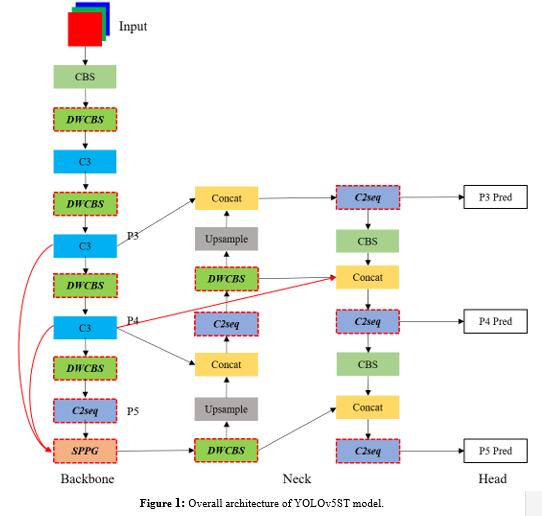
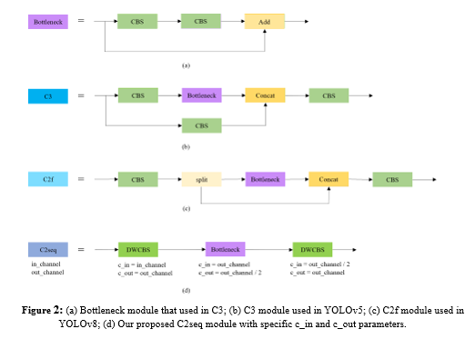
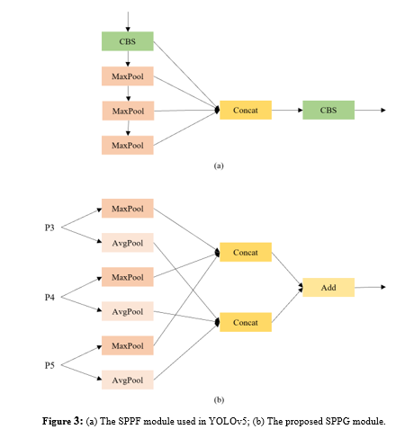
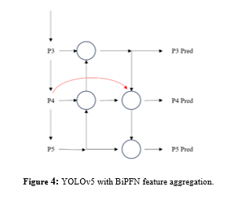

# YOLOv5ST

__Abstract:__ Scene text detection is an important task in computer vision. In this paper, we present YOLOv5ST (YOLOv5 Scene Text), an optimized architecture based on YOLOv5 v6.0 tailored for fast scene text detection. Our primary goal is to enhance inference speed without sacrificing significant detection accuracy, thereby enabling robust performance on resource-constrained devices like drones, closed-circuit television cameras, and other embedded systems. To achieve this, we propose key modifications on the network architecture to lighten the original backbone and improve feature aggregation, including replacing standard convolution with depth-wise convolution, adopting the C2 sequence module in place of C3, employing SPPG instead of SPPF and integrating BiFPN into the neck. Experimental results demonstrate a remarkable 26% improvement in inference speed compared to the baseline, with only marginal reductions of 1.6% and 4.2% in mean average precision (mAP) at intersection over union (IoU) thresholds of 0.5 and 0.5:0.95, respectively. Our work represents a significant advancement in scene text detection, striking a balance between speed and accuracy, making it well-suited for performance-constrained environments.

__When training, set --cfg as yolov5st.yaml__

